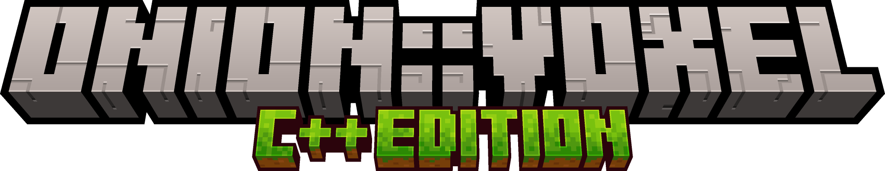

# OnionVoxel

**OnionVoxel** is a multiplayer voxel-based sandbox game written in modern **C++**, inspired by *Minecraft*.
The project focuses on building a lightweight, custom game engine from the ground up with a strong emphasis on graphics programming and engine architecture.

---

## 🎯 Project Goals

* Learn how to design and implement a game engine from scratch
* Deepen knowledge of modern C++ and real-time graphics
* Understand OpenGL rendering pipelines and GPU concepts
* Explore multiplayer architecture fundamentals
* Experiment custom User Interface (UI) and input systems
* Have fun experimenting and iterating

---

## 🛠 Tech Stack

Core technologies powering the engine:

* **C++** – Main language (modern standard)
* **OpenGL** (via glad) – Rendering API
* **GLFW** – Window creation and input handling
* **GLM** – Mathematics library (vectors, matrices, transformations)
* **STB Image** – Texture loading

---

## 📦 Dependencies

### Internal Modules

Custom utilities:

* `onion::datetime`
* `onion::event`
* `onion::logger`
* `onion::timer`

These modules provide foundational services such as logging, timing, and event handling.

### External Libraries

* glad
* glfw
* GLM
* STB Image

---

## 🚀 Features

* WIP

---

## 🔨 Building

* WIP

---

## 📚 Learning Focus Areas

This project touches on:

* Rendering pipelines
* Chunk-based voxel world systems
* Input and camera systems
* Real-time performance considerations
* Multiplayer synchronization
* Custom User Interface (UI) development

---
