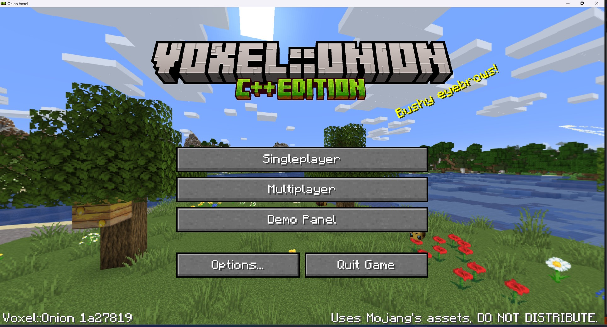
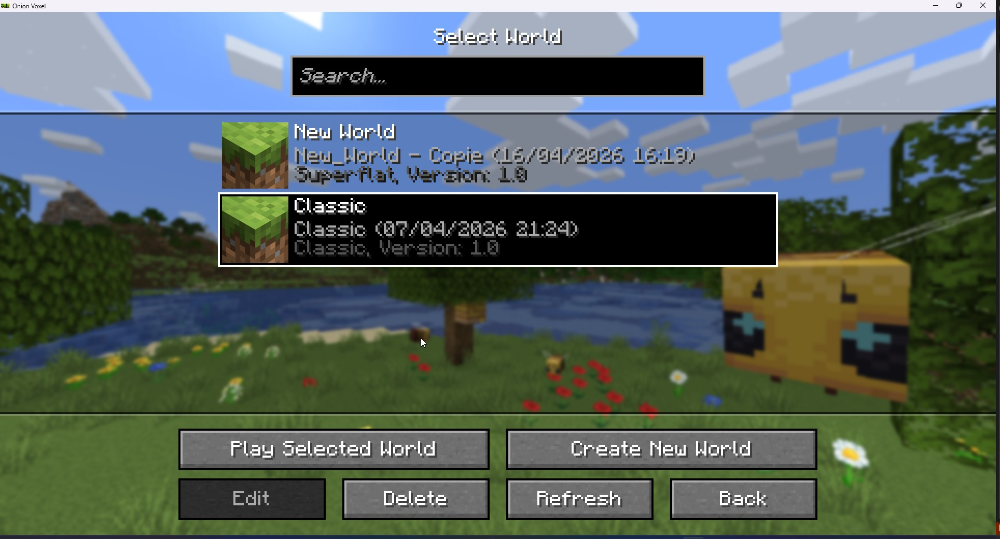
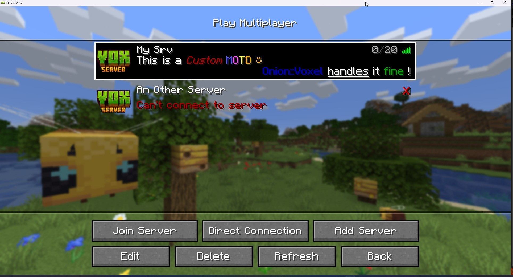
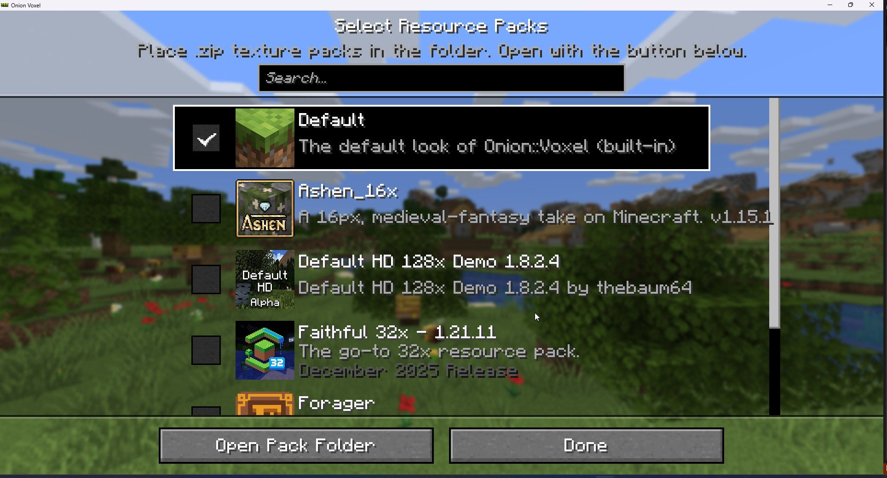
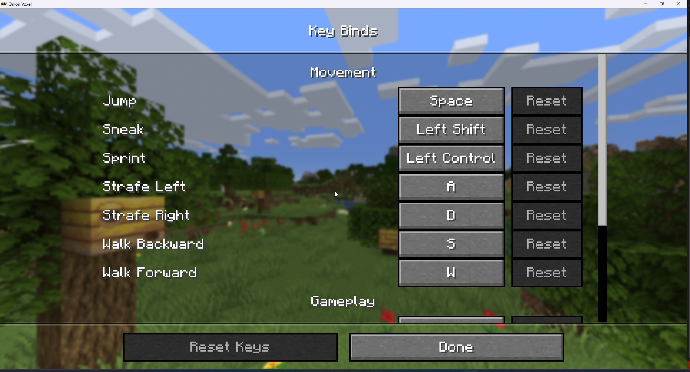
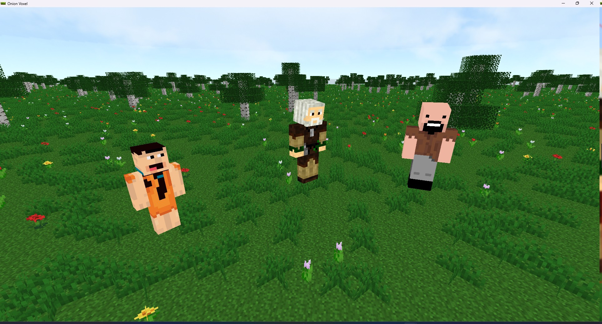
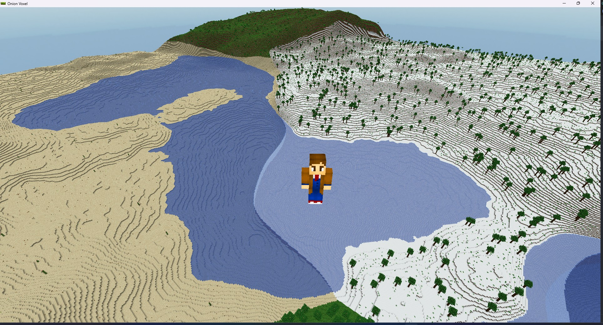
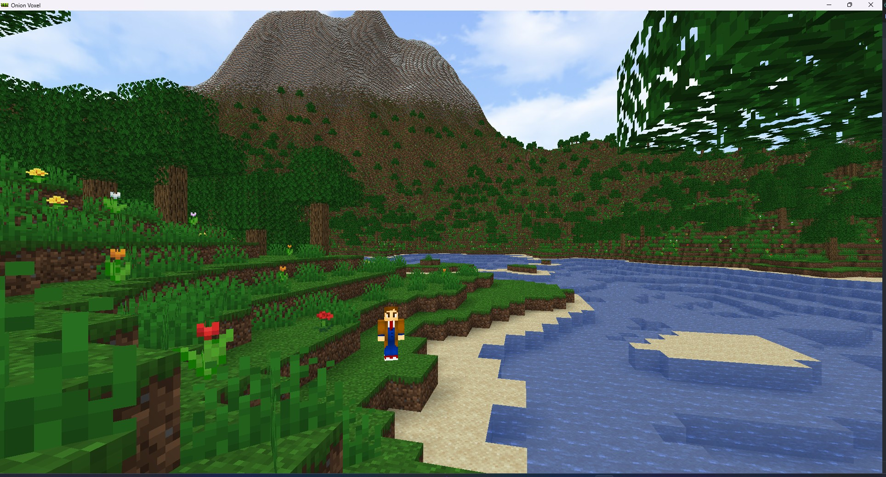

# OnionVoxel

**OnionVoxel** is a multiplayer voxel-based sandbox game written in modern **C++**, basically a *Minecraft* clone.
The project focuses on building a lightweight, custom game engine from the ground up with a strong emphasis on graphics programming and engine architecture.

---

## 📷 Screenshots

<details>
<summary>Click to expand</summary>

 | 
:---:|:---:
Main Menu | Singleplayer Menu

 | 
:---:|:---:
Multiplayer Menu | Resource Packs Menu

 | 
:---:|:---:
Key Binds Menu | Multiplayer with 3 Players

 | 
:---:|:---:
World Classic | World Classic No Biomes

</details>

---

## 🎯 Project Goals

* Learn how to design and implement a game engine from scratch
* Deepen knowledge of modern C++ and real-time graphics
* Understand OpenGL rendering pipelines and GPU concepts
* Explore multiplayer architecture fundamentals
* Experiment custom User Interface (UI) and input systems
* Have fun experimenting and iterating

---

## 🛠 Tech Stack

Core technologies powering the engine:

* **C++** – Main language (modern standard)
* **GitHub** – Version control and project management
* **CMake** – Build system
* **OpenGL** (via glad) – Rendering API

---

## 📦 Dependencies

### Internal Modules

Custom utilities:

* `onion::datetime`
* `onion::event`
* `onion::logger`
* `onion::timer`
* `onion::threadpool`
* `onion::threadsafequeue`


These modules provide foundational services such as logging, timing, event handling, ...

### External Libraries

* **GLFW** – Window creation and input handling
* **GLM** – Mathematics library (vectors, matrices, transformations)
* **STB Image** – Texture loading
* **ENet** – Networking library for multiplayer features
* **Dear ImGui** – Immediate mode GUI for debugging and tools
* **Cereal** – Serialization library for saving/loading game data and network messages
* **FastNoiseLite** – Procedural noise generation for terrain and world features
* **Miniz** - Compression library for reading textures from zip resource packs
* **Nlohmann JSON** - JSON library for configuration files and data serialization

---

## 🏗 Architecture

### Project Structure

OnionVoxel follows a **client-server architecture** with shared components:

```
src/
├── client/    # Rendering, UI, input handling, player interaction
├── server/    # World authority, chunk generation, multiplayer host
└── shared/    # Common code (world, entities, networking, physics)
```

**Singleplayer mode**: Client runs a local embedded server instance  
**Multiplayer mode**: Client connects to remote dedicated server

<details>
<summary>Client-Server Data Flow Diagram</summary>

```
┌─────────────────────────────────────────────────────────────┐
│                         CLIENT                              │
├─────────────────────────────────────────────────────────────┤
│  Renderer → Input → WorldManager (client-side prediction)   │
│      ↓                      ↓                                │
│  NetworkClient ←────────────┘                                │
│      ↓ (PlayerInfoMsg, BlocksChangedMsg)                     │
└──────┼──────────────────────────────────────────────────────┘
       │
       │ ENet (Reliable UDP)
       ↓
┌─────────────────────────────────────────────────────────────┐
│                         SERVER                              │
├─────────────────────────────────────────────────────────────┤
│  NetworkServer → WorldManager (authoritative)                │
│      ↓                      ↓                                │
│  Broadcast ←────── EntitySnapshot (100ms timer)              │
│      ↓ (ChunkDataMsg, EntitySnapshotMsg, BlocksChangedMsg)  │
└──────┼──────────────────────────────────────────────────────┘
       │
       │ ENet (Reliable UDP)
       ↓
    All Clients
```

**Data Flow**:
- **Client → Server**: Player actions, block changes, position updates
- **Server → Clients**: Chunk data, entity snapshots, authoritative block changes
- **Synchronization**: Server broadcasts entity snapshots every 100ms for multiplayer sync

</details>

### Multi-Threading Model

The engine uses extensive multi-threading:

<details>
<summary>Threading Details</summary>

#### Client Threads
- **Main Thread**: Coordinates lifecycle, event handling, network I/O
- **Render Thread** (`std::jthread`): Dedicated OpenGL rendering and UI loop
- **Network Threads**: ENet event polling and message dispatch
- **Mesh Builder ThreadPool**: Asynchronously builds chunk meshes

#### Server Threads
- **Main Thread**: Network events, player connections, message routing
- **WorldGenerator ThreadPool**: Async procedural terrain generation using FastNoiseLite
- **Timer Thread**: Periodic entity snapshot broadcasts (100ms intervals)

**Thread Safety**: Shared mutexes for chunk/entity maps, atomic variables for flags, custom `ThreadSafeQueue` for message passing

</details>

### Key Design Patterns

<details>
<summary>Architectural Patterns</summary>

#### Event-Driven Architecture
Custom **`onion::Event<T>`** observer pattern for decoupled components:
- `WorldManager` events trigger mesh rebuilds in `WorldRenderer`
- Network messages trigger world/entity updates
- Thread-safe with automatic cleanup via RAII handles

#### Manager Pattern
Central coordinators for subsystems:
- **WorldManager**: Chunks, entities, generation, persistence
- **EntityManager**: Player and entity tracking
- **NetworkClient/Server**: ENet connections and message routing
- **AssetsManager**: Resource pack loading and texture management

#### Client-Server Synchronization
- **Server Authority**: Server has final say on all world state (well ... Not yet hahaha)
- **Client Prediction**: Immediate local updates with server reconciliation
- **Chunk Streaming**: Only send/load chunks near players (simulation distance)
- **Entity Snapshots**: Periodic broadcasts for multiplayer synchronization

#### Message-Based Networking
- **Protocol**: ENet (reliable UDP) with binary serialization (Cereal library)
- **Type-Safe Messages**: `std::variant` with visitor pattern for message dispatch
- **Reliability**: Chunk/block data uses reliable packets, player positions use unreliable (interpolation handles drops)

</details>

### Data Structures

<details>
<summary>Core Data Structures</summary>

#### Chunk System
- **Chunk**: 64x64 blocks (XZ), variable height divided into SubChunks
- **SubChunk**: 64x64x64 blocks (262 144 voxels) with palette compression
- **Palette**: Stores unique block types, block indices reference palette entries
- **Benefits**: Memory efficient (many air blocks = single palette entry), fast serialization

#### Rendering
- **Three Render Passes**: Opaque → Cutout (alpha test) → Transparent (alpha blend)
- **Async Mesh Building**: ThreadPool generates meshes off-thread to avoid frame drops
- **Ambient Occlusion**: Per-vertex lighting data for smooth shading

#### Networking
- **ENet Protocol**: Reliable UDP with custom message types
- **Message Types**: Chunks, entities, block changes, player positions, server info
- **ThreadSafeQueue**: Producer-consumer pattern for cross-thread message passing
- **Serialization**: Cereal library for binary serialization of messages and save files

</details>

---

## 🚀 Features

### Core Gameplay
* **Player Movements and Actions**: Walk, Run, Jump, Fly, Break Blocks, Place Cobblestone, Collision Detection, FreeCam mode
* **Singleplayer**: Local world generation and gameplay with save/load support
* **Multiplayer**: Client-server architecture for online play with entity and chunk synchronization

### World System
* **World Generation**: Chunk-based procedural terrain generation using noise functions
  <details>
  <summary>Available World Types</summary>

  * **Superflat**: Flat world with trees and grass
  * **Classic No Biomes**: Mountains, Forest and Sea without biome variation
  * **Classic**: Full biome support (Ocean, Desert, Snow, Plains, Mountains)
  * **BiomeVisualizer**: Superflat version of "Classic" for testing biome distribution
  </details>

* **World Saving/Loading**: Serialization of world data for persistence (chunk-based)

### User Interface
* **Custom UI Framework**: Fully custom immediate-mode UI system built from scratch with advanced controls
  <details>
  <summary>UI Controls (Click to expand)</summary>

  #### Core Controls
  * **Label**: Uses resource pack fonts with full Minecraft formatting support
    * 16 colors via `§` formatting codes
    * Text styles: Bold, Strikethrough, Underline, Italic
    * Alignment: Left, Right, Center
    * Unicode support (UTF-32, `\u...` escape sequences)
  
  * **Button**: Built on Label system, inherits all formatting capabilities
  
  * **Checkbox**: Standard checkbox control with custom styling
  
  * **TextField**: Advanced text input with full editing features
    * Text input and deletion via keyboard
    * Cursor positioning and navigation
    * Text selection (mouse drag, Shift+Arrows, Shift+Click)
    * Word-based navigation (Ctrl+Arrows)
    * Clipboard operations (Ctrl+C, Ctrl+X, Ctrl+V)
    * Delete keys (Backspace, Delete)
    * Selection highlighting with custom background
    * Focus management (Escape to unfocus)
  
  * **Slider**: Integer value slider with custom styling
  
  * **Scroller**: Scrolling container with vertical offset and visible area clipping
  
  * **Sprite**: Image rendering from PNG or raw texture data

  #### Base Components
  * **NineSliceSprite**: Minecraft-style 9-slice texture rendering (used for Button, Checkbox, Scroller, Slider borders)
  * **Font**: Low-level text rendering system (foundation for Label)

  </details>

  <details>
  <summary>Available Menus</summary>

  * **Main Menu**
  * **Singleplayer Menu**: World selection, World Creation, World Deletion, Filter
  * **Multiplayer Menu**: Server selection, Register server, Delete registered server, Direct Connection
  * **Options Menu**: FOV, Video Settings, Controls, ResourcePacks
    * **Video Settings**: Max Framerate, VSync, Render Distance
    * **Resource Packs**: Filter, ResourcePack selection, Open Pack Folder
    * **Controls**: Mouse Settings, Key Binds
      * **Mouse Settings**: Sensitivity, Scroll Sensitivity
      * **Key Binds**: Bind every Action to any Key
  * **Pause Menu**: Back to game, Options, Save and quit to title
  </details>

### Customization
* **Resource Packs**: Support for loading textures from *Minecraft* .zip resource packs
* **Skin Rendering**: Render the official Minecraft's player Skin depending on PlayerName
* **Configurable Settings**: All graphics, controls, and gameplay settings are saved and persistent

---

## 🔨 Building

### Prerequisites
* CMake 3.15+
* C++20 compatible compiler (MSVC, GCC, or Clang)
* Git (for submodules)

### Build Steps
```bash
git clone --recursive https://github.com/your-repo/onion-voxel.git
cd onion-voxel
cmake -B build
cmake --build build --config Release
```

### Running
* **Client**: `./build/Release/OnionVoxelClient`
* **Server**: `./build/Release/OnionVoxelServer`

---

## 🗺 Roadmap

*Last updated: 16/04/2026*

### Planned Enhancements

#### Audio System
- Sound effects (block breaking, footsteps, ambient sounds)
- Background music

#### Rendering Improvements
- Non-full block rendering (water surface, cactus, slabs, stairs)
- Animated textures (water, lava, portal)
- First-person arm/hand rendering with held item
- Walking animation for first-person view
- Particle effects (breaking blocks, footsteps)

#### Gameplay Features
- Creative mode with block selection UI and inventory management
- Sneaking state
- FOV change when sprinting
- Chat system for multiplayer
- Player list display (Tab key)

#### Multiplayer Enhancements
- Player name display above heads
- Player position interpolation for smoother movement

#### UI/UX
- Tooltips on hover
- Fix Z-ordering issue in GUI system

#### Physics & Collision
- Swept AABB collision detection for better accuracy

#### Completed
- ~~Update GitHub README.md~~
- ~~View frustum culling for better performance~~

### Known Issues
- Z-ordering issue in GUI (temporary workaround in TextField)
- Client doesn't return to main menu when server closes
- Random crashes when loading worlds (suspected port binding issue)

---

## 📄 License

Well, since it use the official Minecraft's textures, that seems illegal.
Please don't tell Mojang about this project...

No commercial intent of course.
That thing is not even playable yet, nobody would be interested in it watsoever.

---
