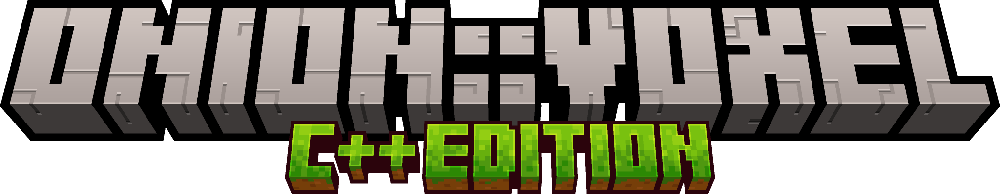
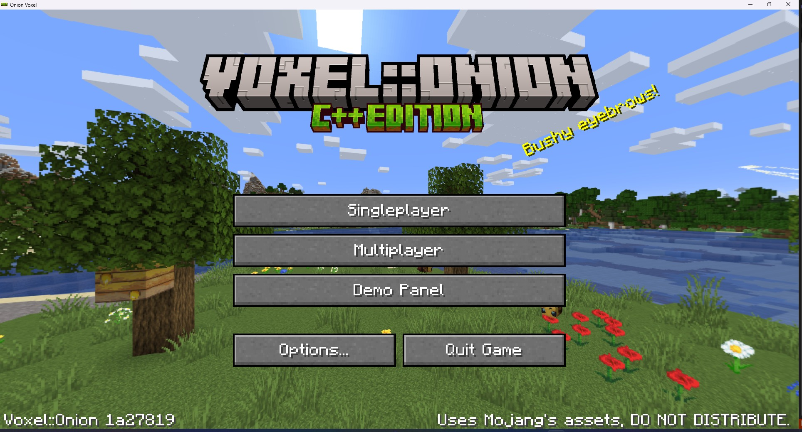
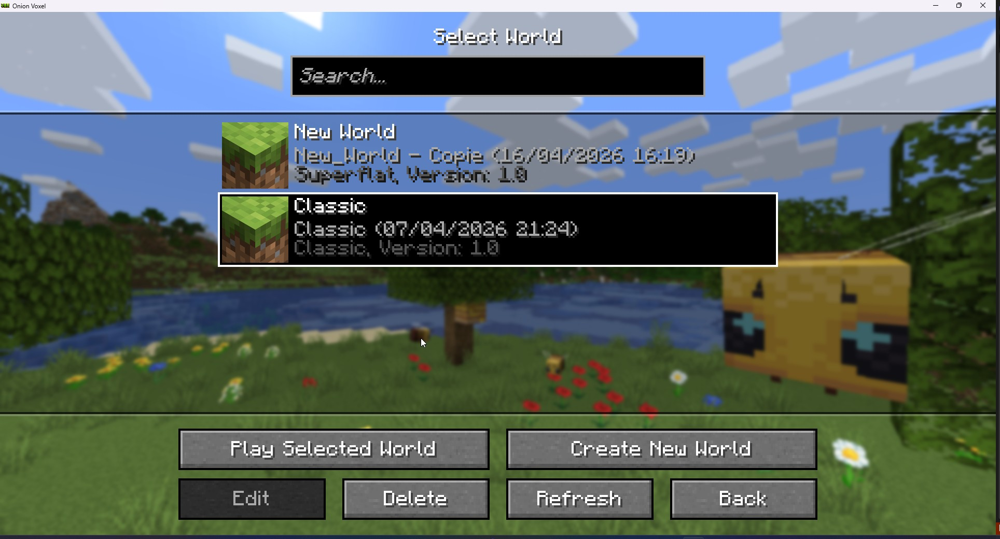
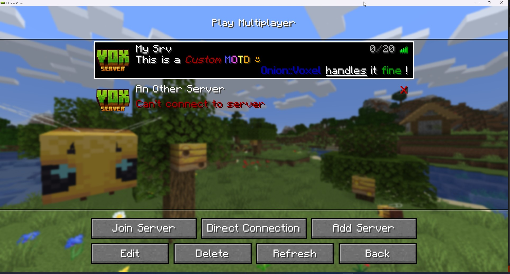
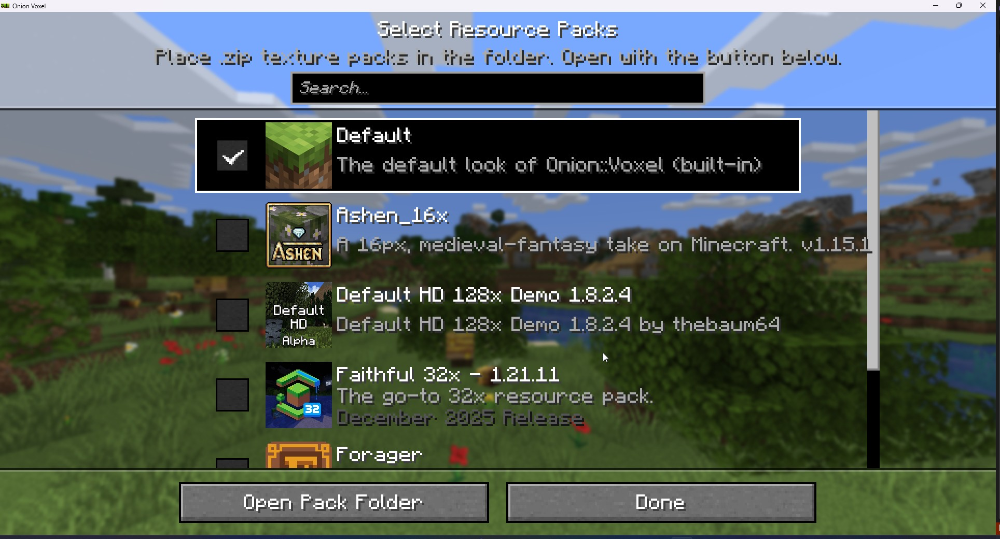
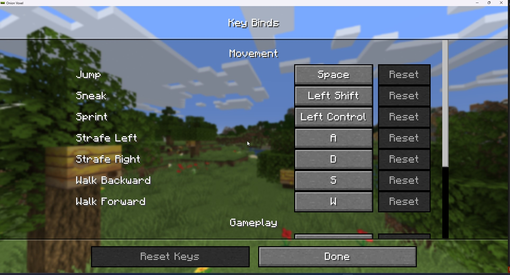
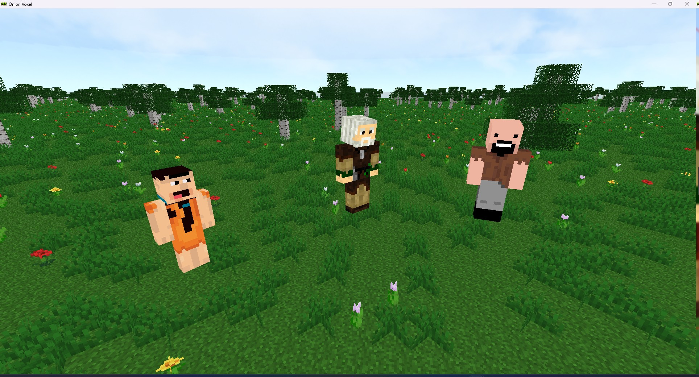
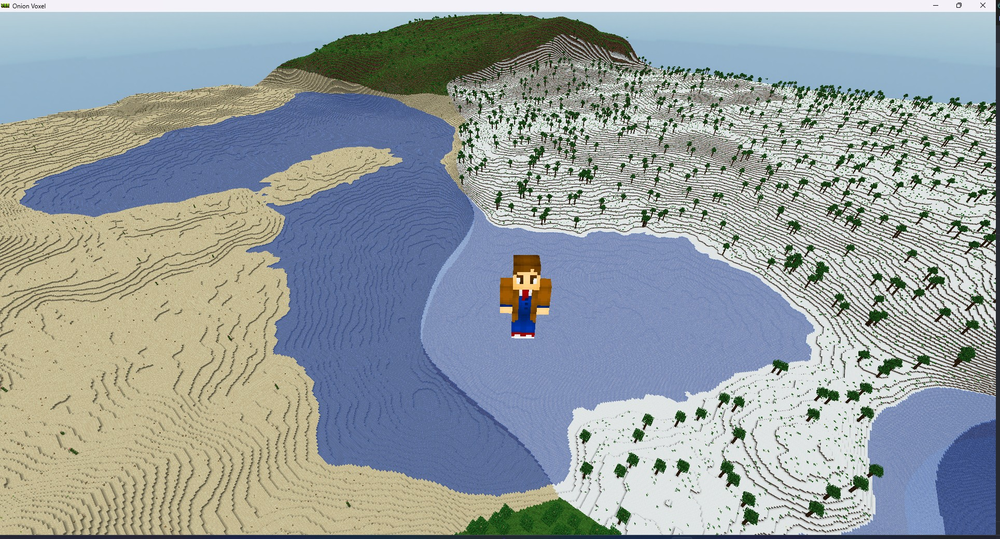
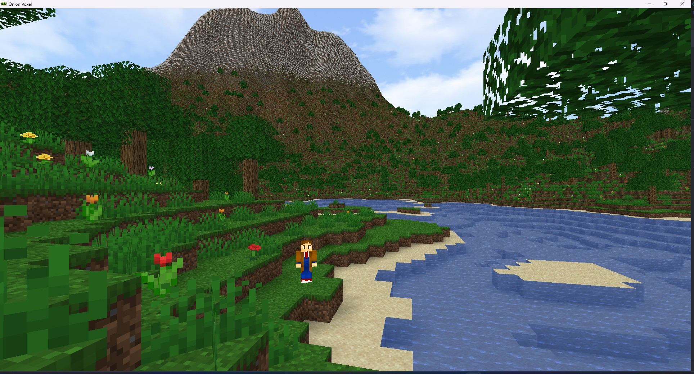
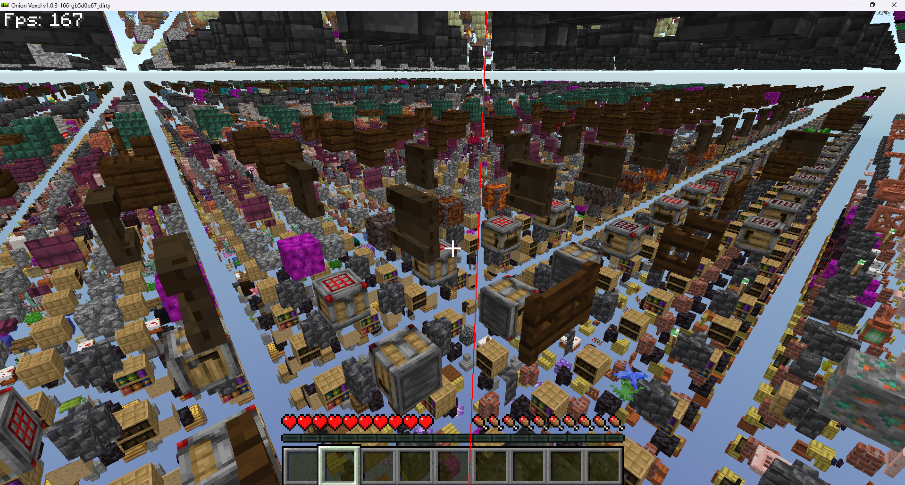

# OnionVoxel

**OnionVoxel** is a multiplayer voxel-based sandbox game written in modern **C++**, basically a *Minecraft* clone.
The project focuses on building a lightweight, custom game engine from the ground up with a strong emphasis on graphics programming and engine architecture.

---

## Platform Support

| Platform | Status |
|----------|--------|
| **Windows (MSVC)** | Primary development platform — fully supported |
| **Linux (GCC/Clang)** | Compiles and runs (tested on Ubuntu via VSCode) |

> **Linux caveat**: There is a known bug where the camera does not move at all, likely caused by a Wayland input issue. The project has been developed and compiled primarily on **Windows with MSVC** — that is the recommended environment. Linux support is experimental.

---

## 📷 Screenshots

<details>
<summary>Click to expand</summary>

 | 
:---:|:---:
Main Menu | Singleplayer Menu

 | 
:---:|:---:
Multiplayer Menu | Resource Packs Menu

 | 
:---:|:---:
Key Binds Menu | Multiplayer with 3 Players

 | 
:---:|:---:
World Classic | World Classic No Biomes

 |
:---:|
Demo Blocks |

</details>

---

## 🎯 Project Goals

* Learn how to design and implement a game engine from scratch
* Deepen knowledge of modern C++ and real-time graphics
* Understand OpenGL rendering pipelines and GPU concepts
* Explore multiplayer architecture fundamentals
* Experiment custom User Interface (UI) and input systems
* Have fun experimenting and iterating

---

## 🛠 Tech Stack

Core technologies powering the engine:

* **C++** – Main language (modern standard)
* **GitHub** – Version control and project management
* **CMake** – Build system
* **OpenGL** (via glad) – Rendering API

---

## 📦 Dependencies

### Internal Modules

Custom utilities:

* `onion::datetime`
* `onion::event`
* `onion::logger`
* `onion::timer`
* `onion::threadpool`
* `onion::threadsafequeue`


These modules provide foundational services such as logging, timing, event handling, ...

### External Libraries

* **GLFW** – Window creation and input handling
* **GLM** – Mathematics library (vectors, matrices, transformations)
* **STB Image** – Texture loading
* **ENet** – Networking library for multiplayer features
* **Dear ImGui** – Immediate mode GUI for debugging and tools
* **Cereal** – Serialization library for saving/loading game data and network messages
* **FastNoiseLite** – Procedural noise generation for terrain and world features
* **Miniz** - Compression library for reading textures from zip resource packs
* **Nlohmann JSON** - JSON library for configuration files and data serialization

---

## 🏗 Architecture

### Project Structure

OnionVoxel follows a **client-server architecture** with shared components:

```
src/
├── client/    # Rendering, UI, input handling, player interaction
├── server/    # World authority, chunk generation, multiplayer host
└── shared/    # Common code (world, entities, networking, physics)
```

**Singleplayer mode**: Client runs a local embedded server instance  
**Multiplayer mode**: Client connects to remote dedicated server

<details>
<summary>Client-Server Data Flow Diagram</summary>

```
┌─────────────────────────────────────────────────────────────┐
│                         CLIENT                              │
├─────────────────────────────────────────────────────────────┤
│  Renderer → Input → WorldManager (client-side prediction)   │
│      ↓                      ↓                                │
│  NetworkClient ←────────────┘                                │
│      ↓ (PlayerInfoMsg, BlocksChangedMsg)                     │
└──────┼──────────────────────────────────────────────────────┘
       │
       │ ENet (Reliable UDP)
       ↓
┌─────────────────────────────────────────────────────────────┐
│                         SERVER                              │
├─────────────────────────────────────────────────────────────┤
│  NetworkServer → WorldManager (authoritative)                │
│      ↓                      ↓                                │
│  Broadcast ←────── EntitySnapshot (100ms timer)              │
│      ↓ (ChunkDataMsg, EntitySnapshotMsg, BlocksChangedMsg)  │
└──────┼──────────────────────────────────────────────────────┘
       │
       │ ENet (Reliable UDP)
       ↓
    All Clients
```

**Data Flow**:
- **Client → Server**: Player actions, block changes, position updates
- **Server → Clients**: Chunk data, entity snapshots, authoritative block changes
- **Synchronization**: Server broadcasts entity snapshots every 100ms for multiplayer sync

</details>

### Multi-Threading Model

The engine uses extensive multi-threading:

<details>
<summary>Threading Details</summary>

#### Client Threads
- **Main Thread**: Coordinates lifecycle, event handling, network I/O
- **Render Thread** (`std::jthread`): Dedicated OpenGL rendering and UI loop
- **Network Threads**: ENet event polling and message dispatch
- **Mesh Builder ThreadPool**: Asynchronously builds chunk meshes

#### Server Threads
- **Main Thread**: Network events, player connections, message routing
- **WorldGenerator ThreadPool**: Async procedural terrain generation using FastNoiseLite
- **Timer Thread**: Periodic entity snapshot broadcasts (100ms intervals)

**Thread Safety**: Shared mutexes for chunk/entity maps, atomic variables for flags, custom `ThreadSafeQueue` for message passing

</details>

### Key Design Patterns

<details>
<summary>Architectural Patterns</summary>

#### Event-Driven Architecture
Custom **`onion::Event<T>`** observer pattern for decoupled components:
- `WorldManager` events trigger mesh rebuilds in `WorldRenderer`
- Network messages trigger world/entity updates
- Thread-safe with automatic cleanup via RAII handles

#### Manager Pattern
Central coordinators for subsystems:
- **WorldManager**: Chunks, entities, generation, persistence
- **EntityManager**: Player and entity tracking
- **NetworkClient/Server**: ENet connections and message routing
- **AssetsManager**: Resource pack loading and texture management

#### Client-Server Synchronization
- **Server Authority**: The server is **not authoritative yet** — implementing full server authority is complex and has been deferred.
  - The server handles chunk generation, chunk distribution, and physics for non-player entities
  - The client handles its own player movement and actions, sends them to the server, which broadcasts to other players
  - The server **trusts the client blindly** — there is no validation or anti-cheat
- **Client Prediction**: Immediate local updates with server reconciliation
- **Chunk Streaming**: Only send/load chunks near players (simulation distance)
- **Entity Snapshots**: Periodic broadcasts for multiplayer synchronization

#### Message-Based Networking
- **Protocol**: ENet (reliable UDP) with binary serialization (Cereal library)
- **Type-Safe Messages**: `std::variant` with visitor pattern for message dispatch
- **Reliability**: Chunk/block data uses reliable packets, player positions use unreliable (interpolation handles drops)

</details>

### Data Structures

<details>
<summary>Core Data Structures</summary>

#### Chunk System
- **Chunk**: 64x64 blocks (XZ), variable height divided into SubChunks
- **SubChunk**: 64x64x64 blocks (262 144 voxels) with palette compression
- **Palette**: Stores unique block types, block indices reference palette entries
- **Benefits**: Memory efficient (many air blocks = single palette entry), fast serialization

#### Rendering
- **Three Render Passes**: Opaque → Cutout (alpha test) → Transparent (alpha blend)
- **Async Mesh Building**: ThreadPool generates meshes off-thread to avoid frame drops
- **Ambient Occlusion**: Per-vertex lighting data for smooth shading

#### Networking
- **ENet Protocol**: Reliable UDP with custom message types
- **Message Types**: Chunks, entities, block changes, player positions, server info, chat messages
- **ThreadSafeQueue**: Producer-consumer pattern for cross-thread message passing
- **Serialization**: Cereal library for binary serialization of messages and save files

</details>

---

## 🚀 Features

### Core Gameplay
* **Player Movement**: Walk, sprint, jump, fly, sneak (with coyote time and edge detection), FreeCam mode
* **Player Actions**: Break blocks, place blocks, pick block (middle-click), drop item (Q key)
* **Block Placement**: Orientation-aware placement — logs, stairs, slabs, buttons, fences, walls, and glass panes all connect or orient correctly based on context
* **Collision Detection**: Swept AABB collision against block model geometry (not just full cubes) — stairs, slabs, fences, etc. all have correct hitboxes
* **Step-up**: Player automatically steps up slabs, stairs, and other partial blocks up to 0.6 blocks in height
* **Item Stacks**: Items have stack sizes
* **Singleplayer**: Local world generation and gameplay with save/load support
* **Multiplayer**: Client-server architecture for online play with entity and chunk synchronization

### World System
* **World Generation**: Chunk-based procedural terrain generation using noise functions
  <details>
  <summary>Available World Types</summary>

  * **Superflat**: Flat world with trees and grass
  * **Classic No Biomes**: Mountains, Forest and Sea without biome variation
  * **Classic**: Full biome support (Ocean, Desert, Snow, Plains, Mountains)
  * **BiomeVisualizer**: Superflat version of "Classic" for testing biome distribution
  * **DemoBlocks**: Showcase world that displays all available blocks and variants
  </details>

* **Block Updates**: Neighbour-aware block state propagation — fences, walls, and glass panes update their connections automatically when adjacent blocks change
* **Dropped Items**: Blocks dropped via Q key become persistent world entities (`BlockEntity`) saved with the chunk
* **World Saving/Loading**: Serialization of world data for persistence (chunks + entities)

### Blocks & Rendering
* **Full Minecraft Block Support**: All blocks and variants loaded from the blockstate registry using `.zip` resource packs (models + textures)
* **Non-Full Block Rendering**: Stairs, slabs, fences, walls, gates, glass panes, doors, buttons, cactus, flowers, tall grass, hanging signs, and more — all rendered with correct geometry
* **Three Render Passes**: Opaque → Cutout (alpha test) → Transparent (alpha blend)
* **View Frustum Culling**: Only visible chunks are submitted for rendering

### HUD & In-Game UI
* **Hotbar**: Scrollable item hotbar with block name display and item rendering
* **HUD**: Health bar, hunger bar, experience bar, crosshair *(display and persistence only — not yet wired into gameplay)*
* **WAILA** (What Am I Looking At): Displays the name and variant info of the block you are looking at
* **In-Game FPS Counter**

### User Interface
* **Custom UI Framework**: Fully custom immediate-mode UI system built from scratch with advanced controls
  <details>
  <summary>UI Controls (Click to expand)</summary>

  #### Core Controls
  * **Label**: Uses resource pack fonts with full Minecraft formatting support
    * 16 colors via `§` formatting codes
    * Text styles: Bold, Strikethrough, Underline, Italic
    * Alignment: Left, Right, Center
    * Unicode support (UTF-32, `\u...` escape sequences)
  
  * **Button**: Built on Label system, inherits all formatting capabilities
  
  * **Checkbox**: Standard checkbox control with custom styling
  
  * **TextField**: Advanced text input with full editing features
    * Text input and deletion via keyboard
    * Cursor positioning and navigation
    * Text selection (mouse drag, Shift+Arrows, Shift+Click)
    * Word-based navigation (Ctrl+Arrows)
    * Clipboard operations (Ctrl+C, Ctrl+X, Ctrl+V)
    * Delete keys (Backspace, Delete)
    * Selection highlighting with custom background
    * Focus management (Escape to unfocus, right-click to clear)
  
  * **Slider**: Integer value slider with custom styling
  
  * **Scroller**: Scrolling container with vertical offset and visible area clipping
  
  * **Sprite**: Image rendering from PNG or raw texture data

  * **Tooltip**: Hover tooltip with correct Z-ordering

  #### Base Components
  * **NineSliceSprite**: Minecraft-style 9-slice texture rendering (used for Button, Checkbox, Scroller, Slider borders)
  * **Font**: Low-level text rendering system (foundation for Label)

  </details>

  <details>
  <summary>Available Menus</summary>

  * **Main Menu**
  * **Singleplayer Menu**: World selection, World Creation, World Deletion, Filter
  * **Multiplayer Menu**: Server selection, Register server, Delete registered server, Direct Connection
  * **Options Menu**: FOV, Video Settings, Controls, ResourcePacks
    * **Video Settings**: Max Framerate, VSync, Render Distance, WAILA toggle
    * **Resource Packs**: Filter, ResourcePack selection, Open Pack Folder
    * **Controls**: Mouse Settings, Key Binds
      * **Mouse Settings**: Sensitivity, Scroll Sensitivity
      * **Key Binds**: Bind every Action to any Key
  * **Pause Menu**: Back to game, Options, Save and quit to title
  * **Creative Inventory**: Full block browser with search, item rendering, pick & move (no crafting)
  * **Chat Panel**: In-game chat with message history and scrollable view
  </details>

### Customization
* **Resource Packs**: Support for loading textures from *Minecraft* .zip resource packs

  > **Partial support — read before using**:
  > - Resource pack support is incomplete and may cause crashes.
  > - Packs **>= 128x** are not supported — they exceed the maximum texture atlas size on most GPUs.
  > - Packs **< 128x** may also fail depending on your graphics card's maximum texture size. 64x is confirmed working.
  >
  > **Recommended packs** (all confirmed working or close to it):
  >
  > | Pack | Resolution | Link |
  > |------|-----------|------|
  > | Faithful 32x | 32x | [CurseForge](https://www.curseforge.com/minecraft/texture-packs/faithful-32x) |
  > | Ashen 16x | 16x | [CurseForge](https://www.curseforge.com/minecraft/texture-packs/ashen-16x) |
  > | Forager 16x | 16x | [CurseForge](https://www.curseforge.com/minecraft/texture-packs/forager) |
  > | PureBDcraft 32x | 32x | [bdcraft.net](https://bdcraft.net/downloads/purebdcraft-minecraft/) |
  > | PureBDcraft 64x | 64x | [bdcraft.net](https://bdcraft.net/downloads/purebdcraft-minecraft/) |
* **Skin Rendering**: Render the official Minecraft's player Skin depending on PlayerName
* **Configurable Settings**: All graphics, controls, and gameplay settings are saved and persistent

---

## 🔨 Building

> **Platform note**: The project is developed and tested primarily on **Windows with MSVC**. Linux (Ubuntu) is supported but experimental — see the [Platform Support](#platform-support) section above.

### Prerequisites
* CMake 3.15+
* C++20 compatible compiler (MSVC recommended; GCC/Clang on Linux)
* Git (for submodules)
* **Windows**: Visual Studio 2026 (the CMake integration is the supported workflow)

### Steps (Windows — Visual Studio)

1. Clone with submodules:
   ```bash
   git clone --recurse-submodules https://github.com/your-repo/onion-voxel.git
   ```
2. Open the folder in **Visual Studio** — it will detect `CMakeSettings.json` automatically and configure the project (`x64-Debug`, `x64-Release`, `x64-Release-Deploy` configs are available).
3. Build via **Build → Build All** (or select the desired configuration from the toolbar).
4. **Install** — this step is required. `AssetsManager` resolves asset paths relative to the executable directory; running the binary directly from the build output directory will fail to find assets.

   Open a **Developer Command Prompt for VS 2022** (x64) and run:
   ```bat
   cmake --install out/build/x64-Release --prefix install
   ```
   This copies the client and server executables together with the full `assets/` tree into `install/`.

### Running

After the install step:

* **Client**: `install/bin/OnionVoxel.exe`
* **Server**: `install/bin/OnionVoxelServer.exe`

> Do **not** run the executables directly from `out/build/` — assets will not be found and the game will not start correctly.

### Steps (Linux — VSCode)

1. Clone with submodules:
   ```bash
   git clone --recurse-submodules https://github.com/your-repo/onion-voxel.git
   ```
2. Install system dependencies (e.g. on Ubuntu): `sudo apt install libcurl4-openssl-dev`
3. Open the folder in **VSCode** with the CMake Tools extension. Configure and build.
4. Install to a local prefix:
   ```bash
   cmake --install build --prefix install
   ```
5. Run from the install prefix: `./install/bin/OnionVoxel`

> **Known issue on Linux**: The camera does not move, most likely due to a Wayland mouse capture bug. Running under XWayland (`DISPLAY=:0`) or a pure X11 session may help, but this has not been confirmed.

---

## 🗺 Roadmap

*Last updated: 09/05/2026*

### Planned Enhancements

#### Audio System
- Sound effects (block breaking, footsteps, ambient sounds)
- Background music

#### Rendering Improvements
- Animated textures (water, lava, portal)
- First-person arm/hand rendering with held item
- Walking animation for first-person view
- Particle effects (breaking blocks, footsteps)

#### Gameplay Features
- Chat commands (/tp, /fly, ...)
- Player list display (Tab key)
- Health, hunger, and experience gameplay (damage, healing, hunger drain — currently display + save only)

#### Multiplayer Enhancements
- Player name display above heads
- Player position interpolation for smoother movement

### Completed

- ~~Chat system for multiplayer~~
- ~~Update GitHub README.md~~
- ~~View frustum culling for better performance~~
- ~~FOV change when sprinting~~
- ~~Non-full block rendering~~ (stairs, slabs, fences, walls, gates, glass panes, doors, buttons, flowers, ...)
- ~~Sneaking state~~ (with coyote time and edge-walk detection)
- ~~Swept AABB collision detection~~ (against actual block model geometry)
- ~~Tooltips on hover~~ (in inventory)
- ~~Creative inventory~~ (block browser, search, pick & move — no crafting)
- ~~Block placement variants~~ (orientation-aware placement for logs, stairs, slabs, fences, buttons, ...)
- ~~Block updates~~ (neighbour-aware state propagation)
- ~~Dropped item system~~ (Q-key drop, BlockEntity, world persistence)
- ~~HUD~~ (health, hunger, experience bar, crosshair — display + save only, not wired into gameplay yet)
- ~~WAILA~~ (What Am I Looking At — block name on crosshair)
- ~~In-game FPS display~~
- ~~Hotbar~~ (scrollable, item rendering, block name display)
- ~~Item stack sizes~~

### Known Issues / Weaknesses
- Z-ordering issue in GUI (temporary workaround in TextField)
- Client doesn't return to main menu when server closes
- Random crashes when loading worlds (suspected port binding issue)
- **Linux / Wayland**: Camera does not move — mouse capture likely broken under Wayland
- **No server authority**: The server trusts the client blindly for player movement and actions. Implementing proper server-side validation is deferred indefinitely — it is a significant architectural undertaking.

---

## 📄 License

Well, since it use the official Minecraft's textures, that seems illegal.
Please don't tell Mojang about this project...

No commercial intent of course.
That thing is not even playable yet, nobody would be interested in it watsoever.

---
